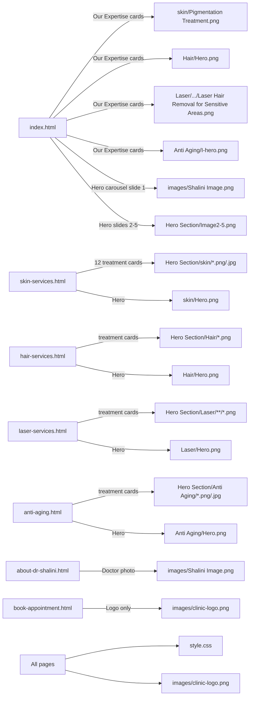
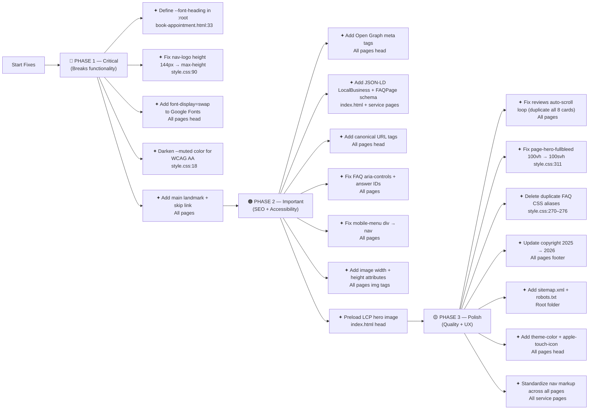

# Amber Clinics Website V3 — Audit Report
**Date:** 2026-04-18  
**Audited by:** Frontend Design Review  
**Scope:** All HTML files + style.css in `/Website-V3`

---

## Folder Structure

```mermaid
graph TD
    ROOT["📁 Website-V3"]

    ROOT --> INDEX["📄 index.html"]
    ROOT --> SKIN["📄 skin-services.html"]
    ROOT --> HAIR["📄 hair-services.html"]
    ROOT --> LASER["📄 laser-services.html"]
    ROOT --> ANTI["📄 anti-aging.html"]
    ROOT --> ABOUT["📄 about-dr-shalini.html"]
    ROOT --> BOOK["📄 book-appointment.html"]
    ROOT --> CSS["🎨 style.css"]

    ROOT --> HS["📁 Hero Section"]
    ROOT --> IMG["📁 images"]
    ROOT --> GAL["📁 gallery"]

    HS --> HS_SKIN["📁 skin"]
    HS --> HS_HAIR["📁 Hair"]
    HS --> HS_LASER["📁 Laser"]
    HS --> HS_ANTI["📁 Anti Aging"]
    HS --> HS_GENERIC["🖼 Hero.png, Image2–6.png"]

    HS_SKIN --> SK1["Acne & Acne Scar Treatment.png"]
    HS_SKIN --> SK2["Anti-Aging-Skin-Tightening.jpg"]
    HS_SKIN --> SK3["Dark Circles & Eye Rejuvenation.png"]
    HS_SKIN --> SK4["Excessive Sweating (Hyperhidrosis).png"]
    HS_SKIN --> SK5["Hero.png"]
    HS_SKIN --> SK6["Keloid & Hypertrophic Scar Treatment.png"]
    HS_SKIN --> SK7["Pigmentation Treatment.png"]
    HS_SKIN --> SK8["Skin Biopsy & Clinical Skin Treatments.png"]
    HS_SKIN --> SK9["Skin Lightening Treatment.png"]
    HS_SKIN --> SK10["Skin Rejuvenation Treatment.png"]
    HS_SKIN --> SK11["Skin-Tag-Mole-Wart-Removal.jpg"]
    HS_SKIN --> SK12["Stretch-Marks-Reduction.jpg"]
    HS_SKIN --> SK13["Vitiligo-Treatment.jpg"]

    HS_HAIR --> HR1["All Clinical Hair Concerns.png"]
    HS_HAIR --> HR2["Alopecia Areata Management.png"]
    HS_HAIR --> HR3["Androgenetic Alopecia Treatment.png"]
    HS_HAIR --> HR4["Dandruff & Scalp Psoriasis Treatment.png"]
    HS_HAIR --> HR5["Grey Hair Prevention & Treatment.png"]
    HS_HAIR --> HR6["Hair Transplant Consultation.png"]
    HS_HAIR --> HR7["Hero.png"]
    HS_HAIR --> HR8["Image1.png"]
    HS_HAIR --> HR9["PRP & Growth Factor Concentrate (GFC).png"]

    HS_LASER --> LR0["Hero.png"]
    HS_LASER --> LR_HAIR["📁 Laser for Hair Reduction"]
    HS_LASER --> LR_SKIN["📁 Laser for Skin Rejuvenation & Anti-Aging"]

    LR_HAIR --> LH1["Beard Shaping.png"]
    LR_HAIR --> LH2["Laser Hair Removal for Sensitive Areas.png"]
    LR_HAIR --> LH3["Triple Wavelength Diode Laser.png"]

    LR_SKIN --> LS1["Carbon Laser Peel (Hollywood Peel).png"]
    LR_SKIN --> LS2["Fractional CO2 Laser.png"]
    LR_SKIN --> LS3["HIFU (High-Intensity Focused Ultrasound).png"]
    LR_SKIN --> LS4["Laser Tatto Removal - Q-Switched Nd-YAG Laser.png"]
    LR_SKIN --> LS5["Laser Toning (Q-Switched Nd-YAG).png"]
    LR_SKIN --> LS6["Microneedling RF.png"]
    LR_SKIN --> LS7["Stretch Mark Reduction.png"]

    HS_ANTI --> AA1["Botox for Wrinkles & Fine Lines.png"]
    HS_ANTI --> AA2["Chemical Peel.png"]
    HS_ANTI --> AA3["Dermal Fillers for Volume Restoration & Enhancement.png"]
    HS_ANTI --> AA4["Hero.png"]
    HS_ANTI --> AA5["Hydrafacial.png"]
    HS_ANTI --> AA6["I-hero.png"]
    HS_ANTI --> AA7["Jawline & Chin Contouring.jpg"]
    HS_ANTI --> AA8["Lip Augmentation & Hydration.jpg"]
    HS_ANTI --> AA9["Non-Surgical-Nose-Job.jpg"]
    HS_ANTI --> AA10["Under-Eye Fillers.jpg"]

    IMG --> I1["clinic-logo.png"]
    IMG --> I2["Shalini Image.png"]

    GAL --> GAL_ANTI["📁 anti-aging"]
    GAL_ANTI --> G1["gallery-01.jpg / .png"]
    GAL_ANTI --> G2["gallery-02.jpg / .png"]
    GAL_ANTI --> G3["gallery-03.jpg / .png"]
    GAL_ANTI --> G4["gallery-04.jpg to gallery-08.png"]
```

---

## File-to-Image Dependency Map

---

## Issues by File

```mermaid
graph TD
    ISSUES["🐛 All Issues"]

    ISSUES --> CSS_ISSUES["🎨 style.css Issues"]
    ISSUES --> INDEX_ISSUES["📄 index.html Issues"]
    ISSUES --> BOOK_ISSUES["📄 book-appointment.html Issues"]
    ISSUES --> ALL_ISSUES["📄 All Pages Issues"]

    CSS_ISSUES --> C1["❌ HIGH: nav-logo img height 144px > --nav-h 100px (line 90)"]
    CSS_ISSUES --> C2["❌ HIGH: --muted color fails WCAG AA contrast (line 18)"]
    CSS_ISSUES --> C3["🟠 MED: No font-display:swap in Google Fonts link"]
    CSS_ISSUES --> C4["🟠 MED: Auto-scroll reviews broken loop math (line 304)"]
    CSS_ISSUES --> C5["🟠 MED: backdrop-filter blur on navbar — expensive on mobile (line 85)"]
    CSS_ISSUES --> C6["🟡 LOW: Duplicate FAQ CSS aliases faq-question/faq-answer (lines 270–276)"]
    CSS_ISSUES --> C7["🟠 MED: .hero-badge-2 left:-20px overflows mobile (line 148)"]
    CSS_ISSUES --> C8["🟠 MED: ratings-bar no 480px fix — overflows small phones (line 182)"]
    CSS_ISSUES --> C9["🟠 MED: page-hero-fullbleed uses 100vh not 100svh (line 311)"]
    CSS_ISSUES --> C10["🟡 LOW: #navbar .container overrides to padding:0 48px (line 86)"]

    INDEX_ISSUES --> I1["❌ HIGH: No main landmark element"]
    INDEX_ISSUES --> I2["❌ HIGH: No skip-to-content link"]
    INDEX_ISSUES --> I3["🟠 MED: Emoji 🌟 in hero-badge — no aria-label (line 101)"]
    INDEX_ISSUES --> I4["🟠 MED: Static urgency text not dynamic (line 91)"]
    INDEX_ISSUES --> I5["🟠 MED: Hero dots role=tablist but dots missing role=tab (line 200)"]
    INDEX_ISSUES --> I6["🟠 MED: Carousel setInterval — no cleanup guard (line 583)"]
    INDEX_ISSUES --> I7["🟡 LOW: Copyright 2025 should be 2026 (line 537)"]
    INDEX_ISSUES --> I8["🟡 LOW: Footer service links dont anchor to sections (lines 505–513)"]

    BOOK_ISSUES --> B1["❌ HIGH: var(--font-heading) undefined in CSS (lines 33, 64)"]
    BOOK_ISSUES --> B2["🟠 MED: Inline style block — not cacheable (line 12–200+)"]
    BOOK_ISSUES --> B3["🟠 MED: Different lighter Google Fonts URL than other pages (line 10)"]

    ALL_ISSUES --> A1["❌ HIGH: No Open Graph meta tags on any page"]
    ALL_ISSUES --> A2["❌ HIGH: No structured data / JSON-LD schema"]
    ALL_ISSUES --> A3["🟠 MED: No canonical URL tags"]
    ALL_ISSUES --> A4["🟠 MED: No image width/height attributes — causes CLS"]
    ALL_ISSUES --> A5["🟠 MED: No srcset / responsive images"]
    ALL_ISSUES --> A6["🟠 MED: Hero LCP image not preloaded"]
    ALL_ISSUES --> A7["🟠 MED: FAQ buttons missing aria-controls + answer IDs"]
    ALL_ISSUES --> A8["🟠 MED: mobile-menu is div not nav element"]
    ALL_ISSUES --> A9["🟠 MED: Auto-scroll reviews cant be paused by keyboard/touch"]
    ALL_ISSUES --> A10["🟡 LOW: No sitemap.xml / robots.txt"]
    ALL_ISSUES --> A11["🟡 LOW: No apple-touch-icon / theme-color meta"]
    ALL_ISSUES --> A12["🟡 LOW: WhatsApp SVG repeated inline on every page (14 copies)"]
    ALL_ISSUES --> A13["🟡 LOW: Carousel no pause on keyboard focus — only mouseenter"]
```

---

## 1. Mobile Responsiveness Issues

| # | Priority | File | Location | Issue | Fix |
|---|----------|------|----------|-------|-----|
| M1 | 🔴 High | `style.css` | Line 90 | `nav-logo img` height `144px` overflows `--nav-h: 100px` navbar | Change to `max-height: calc(var(--nav-h) - 16px)` |
| M2 | 🔴 High | `style.css` | Line 311 | `page-hero-fullbleed` uses `100vh` not `100svh` — overflows on mobile Safari | Change to `min-height: 100svh` |
| M3 | 🟠 Medium | `style.css` | Line 155 | `.hero-slide-content` has `padding-left: 80px` — not corrected until 768px | Add intermediate fix at 992px |
| M4 | 🟠 Medium | `style.css` | Line 148 | `.hero-badge-2` has `left: -20px` — bleeds off-screen on mobile | Add `@media (max-width: 768px) { left: 0; }` |
| M5 | 🟠 Medium | `style.css` | Line 182 | `.ratings-bar-inner` has `flex-wrap: nowrap` — overflows at <480px | Add `flex-wrap: wrap` at 480px |
| M6 | 🟠 Medium | `style.css` | Line 302–304 | Auto-scroll reviews only pauses on `hover` — touch devices can't pause | Add touch event listeners or `IntersectionObserver` pause |
| M7 | 🟠 Medium | All pages | All `` | No `srcset` or `sizes` — full-res images loaded on all devices | Add `srcset` for key hero/card images |
| M8 | 🟠 Medium | `style.css` | Line 295 | Gallery grid stays 2 columns below 480px — too cramped | Add `grid-template-columns: 1fr` at 480px |
| M9 | 🟡 Low | `style.css` | Line 86 | `#navbar .container` uses `padding: 0 48px` — too wide for small phones | Reduce to `padding: 0 16px` at ≤768px |

---

## 2. UI/UX Shortcomings

| # | Priority | File | Location | Issue | Fix |
|---|----------|------|----------|-------|-----|
| U1 | 🟠 Medium | `index.html` | Line 101 | `🌟` emoji in hero badge — no `aria-label`, inconsistent with SVG system | Replace with SVG icon or add `aria-label` |
| U2 | 🟠 Medium | `index.html` | Line 91 | "Limited slots available" is static HTML — erodes trust | Remove or make dynamic |
| U3 | 🟠 Medium | `style.css` | Line 302–304 | Auto-scroll reviews loop: 8 + 2 duplicates ≠ 50% — loop will jump | Duplicate all 8 cards (not just 2) |
| U4 | 🟠 Medium | All service pages | Nav | Service pages nav logo has no text fallback (index.html has one) | Standardize nav across all pages |
| U5 | 🟠 Medium | `style.css` | Line 245 | Treatment card image height fixed at `260px` — inconsistent crop on different aspect ratios | Use `aspect-ratio: 4/3` instead of fixed height |
| U6 | 🟡 Low | `index.html` | Line 537 | Copyright `© 2025` — outdated | Update to `© 2026` |
| U7 | 🟡 Low | `index.html` | Lines 505–513 | Footer service links go to page root, not anchored sections | Add `#treatments` anchor to relevant links |
| U8 | 🟡 Low | All pages | — | No scroll-to-top button on long pages | Add fixed scroll-to-top button |

---

## 3. Performance Issues

| # | Priority | File | Location | Issue | Fix |
|---|----------|------|----------|-------|-----|
| P1 | 🔴 High | All pages | `<head>` | No `font-display: swap` in Google Fonts URL — FOIT on slow connections | Append `&display=swap` to font URL |
| P2 | 🔴 High | `index.html` | `<head>` | LCP image (`Shalini Image.png`) not preloaded | Add `<link rel="preload" as="image" href="images/Shalini Image.png">` |
| P3 | 🟠 Medium | All pages | All `` | No `width`/`height` attributes — causes layout shift (CLS) | Add explicit dimensions to all `` tags |
| P4 | 🟠 Medium | All pages | All `` | No next-gen image formats (WebP/AVIF) — excess file size | Convert PNGs/JPGs to WebP with fallback |
| P5 | 🟠 Medium | `style.css` | Line 302 | Auto-scroll animation runs even when off-screen | Pause with `IntersectionObserver` |
| P6 | 🟠 Medium | `style.css` | Line 85 | `backdrop-filter: blur(16px)` on navbar — GPU-expensive on mobile | Disable on mobile or reduce to `blur(8px)` |
| P7 | 🟡 Low | All pages | Inline SVGs | WhatsApp SVG path (~480 chars) repeated 2× per page across 7 pages = 14 copies | Use `<symbol>` + `<use>` or an SVG sprite |
| P8 | 🟡 Low | `book-appointment.html` | `<style>` block | Inline styles not cacheable across page visits | Move to `style.css` |
| P9 | 🟡 Low | `style.css` | Lines 270–276 | Duplicate FAQ CSS (`.faq-question`/`.faq-answer` aliases) — dead code | Delete the duplicate block |

---

## 4. Accessibility Gaps

| # | Priority | File | Location | Issue | Fix |
|---|----------|------|----------|-------|-----|
| A1 | 🔴 High | All pages | — | No `<main>` landmark wrapping page content | Wrap content in `<main id="main-content">` |
| A2 | 🔴 High | All pages | — | No skip-to-content link | Add `<a href="#main-content" class="skip-link">Skip to content</a>` |
| A3 | 🔴 High | `style.css` | Line 18 | `--muted` (#78716C) on `--cream` (#FAF8F5) = ~4.0:1 — fails WCAG AA for body text | Darken to at least #6B6560 (4.5:1) |
| A4 | 🟠 Medium | All pages | FAQ | `.faq-q` buttons missing `aria-controls`; `.faq-a` divs missing `id` | Add matching `id`/`aria-controls` pairs |
| A5 | 🟠 Medium | All pages | Mobile menu | `
` should be `<nav>` | Change to `<nav class="mobile-menu" ...>` |
| A6 | 🟠 Medium | `index.html` | Line 200 | Hero dots: container has `role="tablist"` but dots lack `role="tab"` | Add `role="tab"` to each `.hero-dot` button |
| A7 | 🟠 Medium | All pages | — | Hero carousel doesn't pause on keyboard focus — only `mouseenter` | Add `focusin`/`focusout` listeners to pause carousel |
| A8 | 🟠 Medium | All pages | — | Auto-scroll reviews can't be paused by keyboard or touch users | Add pause button or keyboard handler |
| A9 | 🟡 Low | `index.html` | Line 101 | `🌟` emoji has no `aria-label` or `role="img"` | Add `aria-label="star"` or use SVG |
| A10 | 🟡 Low | All pages | Gallery | Gallery alt text is generic ("Skin result 1") — not descriptive | Write specific descriptive alt text per image |

---

## 5. SEO Gaps

| # | Priority | File | Location | Issue | Fix |
|---|----------|------|----------|-------|-----|
| S1 | 🔴 High | All pages | `<head>` | No Open Graph meta tags (`og:title`, `og:image`, `og:url`) | Add OG tags to every page's `<head>` |
| S2 | 🔴 High | All pages | `<head>` | No JSON-LD structured data (`LocalBusiness`, `Physician`, `FAQPage`) | Add JSON-LD schema block to `<head>` |
| S3 | 🟠 Medium | All pages | `<head>` | No `<link rel="canonical">` tags | Add canonical URL to every page |
| S4 | 🟠 Medium | All pages | `<head>` | No Twitter Card meta tags | Add `twitter:card`, `twitter:title`, `twitter:image` |
| S5 | 🟠 Medium | Root | — | No `sitemap.xml` | Create and link sitemap |
| S6 | 🟠 Medium | Root | — | No `robots.txt` | Create robots.txt |
| S7 | 🟡 Low | All pages | `<head>` | No `<meta name="theme-color">` | Add `<meta name="theme-color" content="#C8986A">` |
| S8 | 🟡 Low | All pages | `<head>` | No `<link rel="apple-touch-icon">` | Add apple-touch-icon pointing to clinic logo |
| S9 | 🟡 Low | All pages | Footer | Copyright `© 2025` — outdated | Update to `© 2026` |

---

## 6. Code Quality Issues

| # | Priority | File | Location | Issue | Fix |
|---|----------|------|----------|-------|-----|
| Q1 | 🔴 High | `book-appointment.html` | Lines 33, 64 | `var(--font-heading)` used but never defined in `:root` — silently fails | Define `--font-heading: 'Playfair Display', Georgia, serif` in `:root` or replace usage |
| Q2 | 🟠 Medium | `style.css` | Line 90 | `nav-logo img { height: 144px }` — larger than the 100px navbar | Fix to `max-height: calc(var(--nav-h) - 16px)` |
| Q3 | 🟠 Medium | All service pages | Nav | Nav markup differs from `index.html` (no logo fallback text) | Standardize nav HTML across all pages |
| Q4 | 🟠 Medium | `index.html` | Line 583 | `setInterval` in carousel — no guard against duplicate intervals | Clear existing interval before calling `startAuto()` |
| Q5 | 🟡 Low | `style.css` | Lines 270–276 | Duplicate FAQ CSS block — dead code | Delete `.faq-question`, `.faq-answer`, `.faq-item.open .faq-question`, `.faq-item.open .faq-question .faq-icon` |
| Q6 | 🟡 Low | All pages | Inline styles | Many `style=""` attributes for colors, positions — should be CSS classes | Move to named CSS classes in `style.css` |
| Q7 | 🟡 Low | `book-appointment.html` | Line 10 | Lighter Google Fonts URL (missing italic + weight variants) vs all other pages | Use the same full font URL as other pages |
| Q8 | 🟡 Low | All pages | `<head>` | Missing `<meta name="theme-color">` and `<link rel="apple-touch-icon">` | Add to shared head boilerplate |

---

## Priority Fix Order (Recommended)

---

## Notes for Claude Code

When fixing these issues, key file relationships to keep in mind:

- `style.css` is shared across **all 7 pages** — any CSS change affects every page
- `book-appointment.html` has its **own inline `<style>` block** in addition to `style.css`
- The **nav HTML is slightly different** between `index.html` (richer logo fallback) and all service pages (simpler)
- The **FAQ JS** uses `.faq-q` class selectors — `anti-aging.html` may use `.faq-question` (the alias) — verify before removing duplicate CSS
- `gallery/` folder only contains `anti-aging/` images — skin/hair/laser pages reference images from **sibling folders** (`../Amber-Skin-tag-removal/...` etc.) which are **outside** this Website-V3 folder and may not exist in this repo
- The **WhatsApp number** `916304250429` appears in 20+ places across all pages — use search/replace carefully if it ever changes
