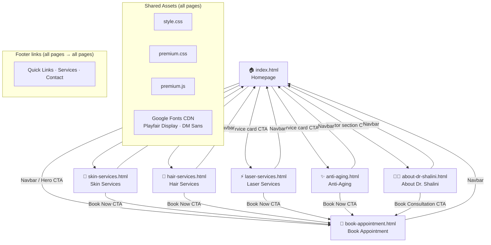
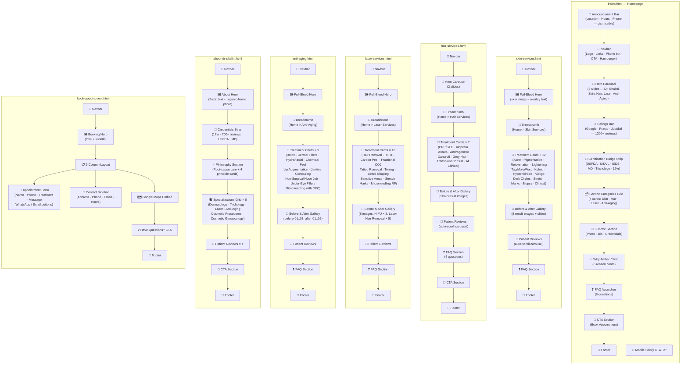
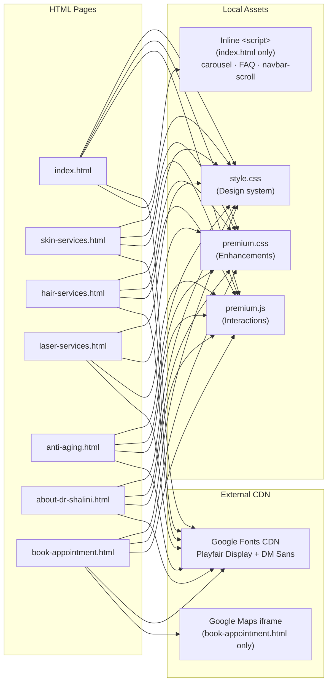
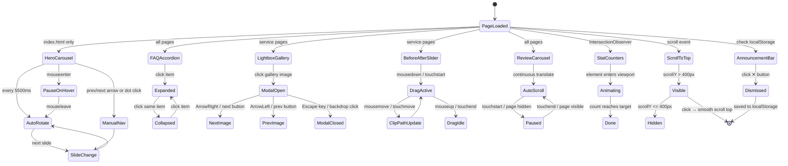

# Amber Clinics Website-V3 — Site Map & Reference Document

> Reference document for code reviews, image QA, and content updates.
> Domain: **amberskinclinics.com** | Last indexed: 2026-04-21

---

## Table of Contents
1. [Directory Tree](#1-directory-tree)
2. [Site Architecture — Page Relationships](#2-site-architecture--page-relationships)
3. [Page → Section Map](#3-page--section-map)
4. [CSS / JS Dependency Map](#4-css--js-dependency-map)
5. [Image Inventory](#5-image-inventory)
6. [JS Component Interaction Map](#6-js-component-interaction-map)
7. [Color & Typography Reference](#7-color--typography-reference)

---

## 1. Directory Tree

```
Website-V3/
├── index.html                          # Homepage
├── skin-services.html                  # Skin treatments page
├── hair-services.html                  # Hair treatments page
├── laser-services.html                 # Laser treatments page
├── anti-aging.html                     # Anti-aging treatments page
├── about-dr-shalini.html               # Doctor biography page
├── book-appointment.html               # Booking & contact page
│
├── style.css                           # Main design system (4,500+ lines)
├── premium.css                         # Micro-interactions & enhancements
├── premium.js                          # Enhanced JS interactions
│
├── sitemap.xml                         # XML sitemap (7 URLs)
├── robots.txt                          # Crawler directives
├── .gitignore
│
├── images/
│   ├── clinic-logo.png                 # Logo (PNG fallback)
│   ├── clinic-logo.webp                # Logo (modern format)
│   ├── Shalini Image.webp              # Dr. Shalini profile photo
│   └── patients/
│       ├── afreen-shah.png
│       ├── arjun-naik.jpg
│       ├── elise-dsilva.png
│       ├── esha-suyavanshi.jpg
│       ├── manorama-dixit.jpg
│       ├── meenal-singh-ambala.jpg
│       └── shabnam-ansari.jpg
│
├── gallery/
│   └── anti-aging/
│       ├── gallery-01.webp
│       ├── gallery-02.webp
│       ├── gallery-03.webp
│       ├── gallery-04.webp
│       ├── gallery-05.webp
│       ├── gallery-06.webp
│       ├── gallery-07.webp
│       └── gallery-08.webp
│
└── Hero Section/
    ├── Hero.webp                       # Homepage hero (desktop)
    ├── Hero-M.webp                     # Homepage hero (mobile)
    ├── Image6.webp                     # General hero variant (desktop)
    ├── Image6-M.webp                   # General hero variant (mobile)
    │
    ├── skin/
    │   ├── Hero.webp                   # Skin page hero (desktop)
    │   ├── Hero-M.webp                 # Skin page hero (mobile)
    │   ├── Hero-Homepage.webp          # Skin card on homepage (desktop)
    │   ├── Hero-Homepage-M.webp        # Skin card on homepage (mobile)
    │   ├── Acne & Acne Scar Treatment.webp
    │   ├── Anti-Aging-Skin-Tightening.webp
    │   ├── Dark Circles & Eye Rejuvenation .webp
    │   ├── Excessive Sweating (Hyperhidrosis).webp
    │   ├── Keloid & Hypertrophic Scar Treatment.webp
    │   ├── Pigmentation Treatment.webp
    │   ├── Skin Biopsy & Clinical Skin Treatments.webp
    │   ├── Skin Lightening Treatment.webp
    │   ├── Skin Rejuvenation Treatment.webp
    │   ├── Skin-Tag-Mole-Wart-Removal.webp
    │   ├── Stretch-Marks-Reduction.webp
    │   ├── Vitiligo-Treatment.webp
    │   └── Before After/
    │       ├── keloid-scar-01.webp
    │       ├── keloid-scar-02.webp
    │       ├── skin-lightening-01.webp
    │       ├── skin-lightening-02.webp
    │       ├── skin-rejuvenation-01.webp
    │       ├── skin-rejuvenation-02.webp
    │       ├── skin-tag-removal-01.webp
    │       └── skin-tag-removal-02.webp
    │
    ├── Hair/
    │   ├── Hero.webp                   # Hair page hero (desktop)
    │   ├── Hero-M.webp                 # Hair page hero (mobile)
    │   ├── Hero-Homepage.webp          # Hair card on homepage (desktop)
    │   ├── Hero-Homepage-M.webp        # Hair card on homepage (mobile)
    │   ├── Image1.webp                 # Hair carousel slide 2 (desktop)
    │   ├── Image1-M.webp               # Hair carousel slide 2 (mobile)
    │   ├── PRP & Growth Factor Concentrate (GFC).webp
    │   ├── Alopecia Areata Management.webp
    │   ├── Androgenetic Alopecia Treatment.webp
    │   ├── Dandruff & Scalp Psoriasis Treatment.webp
    │   ├── Grey Hair Prevention & Treatment.webp
    │   ├── Hair Transplant Consultation & Non-Surgical Restoration.webp
    │   ├── All Clinical Hair Concerns.webp
    │   └── Before After/
    │       ├── hair-result-01.webp
    │       ├── hair-result-02.webp
    │       ├── hair-result-03.webp
    │       ├── hair-result-04.webp
    │       ├── hair-result-05.webp
    │       ├── hair-result-06.webp
    │       ├── hair-result-07.webp
    │       └── hair-result-08.webp
    │
    ├── Laser/
    │   ├── Hero.webp                   # Laser page hero (desktop)
    │   ├── Hero-M.webp                 # Laser page hero (mobile)
    │   ├── Hero-Homepage.webp          # Laser card on homepage (desktop)
    │   ├── Hero-Homepage-M.webp        # Laser card on homepage (mobile)
    │   ├── Laser for Hair Reduction/
    │   │   ├── Beard Shaping.webp
    │   │   ├── Laser Hair Removal for Sensitive Areas.webp
    │   │   └── Triple Wavelength Diode Laser.webp
    │   ├── Laser for Skin Rejuvenation & Anti-Aging/
    │   │   ├── Carbon Laser Peel (Hollywood Peel).webp
    │   │   ├── Fractional CO2 Laser.webp
    │   │   ├── HIFU (High-Intensity Focused Ultrasound).webp
    │   │   ├── Laser Tatto Removal - Q-Switched Nd-YAG Laser.webp
    │   │   ├── Laser Toning (Q-Switched Nd-YAG).webp
    │   │   ├── Microneedling RF.webp
    │   │   └── Stretch Mark Reduction.webp
    │   └── Before After/
    │       ├── hifu-01.webp
    │       ├── hifu-02.webp
    │       ├── hifu-03.webp
    │       ├── laser-hair-removal-01.webp
    │       ├── laser-hair-removal-02.webp
    │       ├── laser-hair-removal-03.webp
    │       ├── laser-hair-removal-04.webp
    │       └── laser-hair-removal-05.webp
    │
    └── Anti Aging/
        ├── Hero.webp                   # Anti-aging page hero (desktop)
        ├── Hero-M.webp                 # Anti-aging page hero (mobile)
        ├── Hero-Homepage.webp          # Anti-aging card on homepage (desktop)
        ├── Hero-Homepage-M.webp        # Anti-aging card on homepage (mobile)
        ├── I-hero.webp                 # Alt standalone hero
        ├── Botox for Wrinkles & Fine Lines.webp
        ├── Chemical Peel.webp
        ├── Dermal Fillers for Volume Restoration & Enhancement.webp
        ├── Hydrafacial.webp
        ├── Jawline & Chin Contouring.webp
        ├── Lip Augmentation & Hydration.webp
        ├── Microneedling with GFC.webp
        ├── Non-Surgical-Nose-Job.webp
        ├── Under-Eye Fillers.webp
        └── Before After/
            ├── before-01.webp
            ├── before-02.webp
            ├── before-03.webp
            ├── after-01.webp
            ├── after-02.webp
            ├── after-03.webp
            ├── after-04.webp
            └── after-05.webp
```

---

## 2. Site Architecture — Page Relationships



---

## 3. Page → Section Map



---

## 4. CSS / JS Dependency Map



### CSS File Responsibilities

| File | Responsibility | Key Sections |
|------|---------------|--------------|
| `style.css` | Full design system | CSS variables, reset, typography, navbar, hero, ratings, stat bars, service cards, doctor section, why-amber, treatment cards, FAQ accordion, reviews carousel, gallery, footer, buttons |
| `premium.css` | Micro-interactions & a11y | Skip link, WCAG contrast fixes, button shimmer, card hover glows, stagger fade-up animations, scroll-to-top button, lightbox modal, before/after slider, mobile tweaks |

### JS File Responsibilities

| File | Responsibility | Key Functions |
|------|---------------|---------------|
| `premium.js` | All enhanced interactions | Announcement bar dismiss, animated stat counters, scroll-to-top toggle, mobile CTA bar, stagger observer, FAQ ARIA IDs, infinite review scroll, lightbox, before/after slider, WhatsApp SVG sprite |
| Inline `<script>` in `index.html` | Core homepage interactions | Navbar scroll class, hamburger menu, hero carousel auto-rotate, FAQ accordion, fade-up IntersectionObserver |

---

## 5. Image Inventory

### 5a. images/ — Logo & Patient Avatars

| Filename | Format | Used In | Purpose |
|----------|--------|---------|---------|
| `clinic-logo.webp` | WebP | All pages (navbar + footer) | Primary logo |
| `clinic-logo.png` | PNG | All pages (fallback `<picture>`) | Logo PNG fallback |
| `Shalini Image.webp` | WebP | index.html, about-dr-shalini.html | Dr. Shalini profile photo |
| `patients/afreen-shah.png` | PNG | Reviews sections | Patient testimonial avatar |
| `patients/arjun-naik.jpg` | JPEG | Reviews sections | Patient testimonial avatar |
| `patients/elise-dsilva.png` | PNG | Reviews sections | Patient testimonial avatar |
| `patients/esha-suyavanshi.jpg` | JPEG | Reviews sections | Patient testimonial avatar |
| `patients/manorama-dixit.jpg` | JPEG | Reviews sections | Patient testimonial avatar |
| `patients/meenal-singh-ambala.jpg` | JPEG | Reviews sections | Patient testimonial avatar |
| `patients/shabnam-ansari.jpg` | JPEG | Reviews sections | Patient testimonial avatar |

### 5b. gallery/ — Anti-Aging Treatment Results

| Filename | Format | Used In | Purpose |
|----------|--------|---------|---------|
| `gallery/anti-aging/gallery-01.webp` | WebP | anti-aging.html | Gallery lightbox image 1 |
| `gallery/anti-aging/gallery-02.webp` | WebP | anti-aging.html | Gallery lightbox image 2 |
| `gallery/anti-aging/gallery-03.webp` | WebP | anti-aging.html | Gallery lightbox image 3 |
| `gallery/anti-aging/gallery-04.webp` | WebP | anti-aging.html | Gallery lightbox image 4 |
| `gallery/anti-aging/gallery-05.webp` | WebP | anti-aging.html | Gallery lightbox image 5 |
| `gallery/anti-aging/gallery-06.webp` | WebP | anti-aging.html | Gallery lightbox image 6 |
| `gallery/anti-aging/gallery-07.webp` | WebP | anti-aging.html | Gallery lightbox image 7 |
| `gallery/anti-aging/gallery-08.webp` | WebP | anti-aging.html | Gallery lightbox image 8 |

### 5c. Hero Section/ — Page Heroes (Desktop + Mobile pairs)

| Filename | Format | Used In | Purpose |
|----------|--------|---------|---------|
| `Hero Section/Hero.webp` | WebP | index.html hero carousel slide 1 | Homepage main hero (desktop) |
| `Hero Section/Hero-M.webp` | WebP | index.html hero carousel slide 1 | Homepage main hero (mobile) |
| `Hero Section/Image6.webp` | WebP | index.html | General hero variant (desktop) |
| `Hero Section/Image6-M.webp` | WebP | index.html | General hero variant (mobile) |

### 5d. Hero Section/skin/ — Skin Page Images

| Filename | Format | Used In | Purpose |
|----------|--------|---------|---------|
| `skin/Hero.webp` | WebP | skin-services.html | Skin page hero (desktop) |
| `skin/Hero-M.webp` | WebP | skin-services.html | Skin page hero (mobile) |
| `skin/Hero-Homepage.webp` | WebP | index.html service card | Skin category card (desktop) |
| `skin/Hero-Homepage-M.webp` | WebP | index.html service card | Skin category card (mobile) |
| `skin/Acne & Acne Scar Treatment.webp` | WebP | skin-services.html | Treatment card image |
| `skin/Anti-Aging-Skin-Tightening.webp` | WebP | skin-services.html | Treatment card image |
| `skin/Dark Circles & Eye Rejuvenation .webp` | WebP | skin-services.html | Treatment card image ⚠️ trailing space in filename |
| `skin/Excessive Sweating (Hyperhidrosis).webp` | WebP | skin-services.html | Treatment card image |
| `skin/Keloid & Hypertrophic Scar Treatment.webp` | WebP | skin-services.html | Treatment card image |
| `skin/Pigmentation Treatment.webp` | WebP | skin-services.html | Treatment card image |
| `skin/Skin Biopsy & Clinical Skin Treatments.webp` | WebP | skin-services.html | Treatment card image |
| `skin/Skin Lightening Treatment.webp` | WebP | skin-services.html | Treatment card image |
| `skin/Skin Rejuvenation Treatment.webp` | WebP | skin-services.html | Treatment card image |
| `skin/Skin-Tag-Mole-Wart-Removal.webp` | WebP | skin-services.html | Treatment card image |
| `skin/Stretch-Marks-Reduction.webp` | WebP | skin-services.html | Treatment card image |
| `skin/Vitiligo-Treatment.webp` | WebP | skin-services.html | Treatment card image |
| `skin/Before After/keloid-scar-01.webp` | WebP | skin-services.html | Before/After slider |
| `skin/Before After/keloid-scar-02.webp` | WebP | skin-services.html | Before/After slider |
| `skin/Before After/skin-lightening-01.webp` | WebP | skin-services.html | Before/After slider |
| `skin/Before After/skin-lightening-02.webp` | WebP | skin-services.html | Before/After slider |
| `skin/Before After/skin-rejuvenation-01.webp` | WebP | skin-services.html | Before/After slider |
| `skin/Before After/skin-rejuvenation-02.webp` | WebP | skin-services.html | Before/After slider |
| `skin/Before After/skin-tag-removal-01.webp` | WebP | skin-services.html | Before/After slider |
| `skin/Before After/skin-tag-removal-02.webp` | WebP | skin-services.html | Before/After slider |

### 5e. Hero Section/Hair/ — Hair Page Images

| Filename | Format | Used In | Purpose |
|----------|--------|---------|---------|
| `Hair/Hero.webp` | WebP | hair-services.html | Hair page hero (desktop) |
| `Hair/Hero-M.webp` | WebP | hair-services.html | Hair page hero (mobile) |
| `Hair/Hero-Homepage.webp` | WebP | index.html service card | Hair category card (desktop) |
| `Hair/Hero-Homepage-M.webp` | WebP | index.html service card | Hair category card (mobile) |
| `Hair/Image1.webp` | WebP | hair-services.html hero carousel | Slide 2 (desktop) |
| `Hair/Image1-M.webp` | WebP | hair-services.html hero carousel | Slide 2 (mobile) |
| `Hair/PRP & Growth Factor Concentrate (GFC).webp` | WebP | hair-services.html | Treatment card image |
| `Hair/Alopecia Areata Management.webp` | WebP | hair-services.html | Treatment card image |
| `Hair/Androgenetic Alopecia Treatment.webp` | WebP | hair-services.html | Treatment card image |
| `Hair/Dandruff & Scalp Psoriasis Treatment.webp` | WebP | hair-services.html | Treatment card image |
| `Hair/Grey Hair Prevention & Treatment.webp` | WebP | hair-services.html | Treatment card image |
| `Hair/Hair Transplant Consultation & Non-Surgical Restoration.webp` | WebP | hair-services.html | Treatment card image |
| `Hair/All Clinical Hair Concerns.webp` | WebP | hair-services.html | Treatment card image |
| `Hair/Before After/hair-result-01.webp` | WebP | hair-services.html | Before/After gallery |
| `Hair/Before After/hair-result-02.webp` | WebP | hair-services.html | Before/After gallery |
| `Hair/Before After/hair-result-03.webp` | WebP | hair-services.html | Before/After gallery |
| `Hair/Before After/hair-result-04.webp` | WebP | hair-services.html | Before/After gallery |
| `Hair/Before After/hair-result-05.webp` | WebP | hair-services.html | Before/After gallery |
| `Hair/Before After/hair-result-06.webp` | WebP | hair-services.html | Before/After gallery |
| `Hair/Before After/hair-result-07.webp` | WebP | hair-services.html | Before/After gallery |
| `Hair/Before After/hair-result-08.webp` | WebP | hair-services.html | Before/After gallery |

### 5f. Hero Section/Laser/ — Laser Page Images

| Filename | Format | Used In | Purpose |
|----------|--------|---------|---------|
| `Laser/Hero.webp` | WebP | laser-services.html | Laser page hero (desktop) |
| `Laser/Hero-M.webp` | WebP | laser-services.html | Laser page hero (mobile) |
| `Laser/Hero-Homepage.webp` | WebP | index.html service card | Laser category card (desktop) |
| `Laser/Hero-Homepage-M.webp` | WebP | index.html service card | Laser category card (mobile) |
| `Laser/Laser for Hair Reduction/Beard Shaping.webp` | WebP | laser-services.html | Treatment card image |
| `Laser/Laser for Hair Reduction/Laser Hair Removal for Sensitive Areas.webp` | WebP | laser-services.html | Treatment card image |
| `Laser/Laser for Hair Reduction/Triple Wavelength Diode Laser.webp` | WebP | laser-services.html | Treatment card image |
| `Laser/Laser for Skin Rejuvenation & Anti-Aging/Carbon Laser Peel (Hollywood Peel).webp` | WebP | laser-services.html | Treatment card image |
| `Laser/Laser for Skin Rejuvenation & Anti-Aging/Fractional CO2 Laser.webp` | WebP | laser-services.html | Treatment card image |
| `Laser/Laser for Skin Rejuvenation & Anti-Aging/HIFU (High-Intensity Focused Ultrasound).webp` | WebP | laser-services.html | Treatment card image |
| `Laser/Laser for Skin Rejuvenation & Anti-Aging/Laser Tatto Removal - Q-Switched Nd-YAG Laser.webp` | WebP | laser-services.html | Treatment card image ⚠️ typo: "Tatto" |
| `Laser/Laser for Skin Rejuvenation & Anti-Aging/Laser Toning (Q-Switched Nd-YAG).webp` | WebP | laser-services.html | Treatment card image |
| `Laser/Laser for Skin Rejuvenation & Anti-Aging/Microneedling RF.webp` | WebP | laser-services.html | Treatment card image |
| `Laser/Laser for Skin Rejuvenation & Anti-Aging/Stretch Mark Reduction.webp` | WebP | laser-services.html | Treatment card image |
| `Laser/Before After/hifu-01.webp` | WebP | laser-services.html | Before/After slider |
| `Laser/Before After/hifu-02.webp` | WebP | laser-services.html | Before/After slider |
| `Laser/Before After/hifu-03.webp` | WebP | laser-services.html | Before/After slider |
| `Laser/Before After/laser-hair-removal-01.webp` | WebP | laser-services.html | Before/After slider |
| `Laser/Before After/laser-hair-removal-02.webp` | WebP | laser-services.html | Before/After slider |
| `Laser/Before After/laser-hair-removal-03.webp` | WebP | laser-services.html | Before/After slider |
| `Laser/Before After/laser-hair-removal-04.webp` | WebP | laser-services.html | Before/After slider |
| `Laser/Before After/laser-hair-removal-05.webp` | WebP | laser-services.html | Before/After slider |

### 5g. Hero Section/Anti Aging/ — Anti-Aging Page Images

| Filename | Format | Used In | Purpose |
|----------|--------|---------|---------|
| `Anti Aging/Hero.webp` | WebP | anti-aging.html | Anti-aging page hero (desktop) |
| `Anti Aging/Hero-M.webp` | WebP | anti-aging.html | Anti-aging page hero (mobile) |
| `Anti Aging/Hero-Homepage.webp` | WebP | index.html service card | Anti-aging category card (desktop) |
| `Anti Aging/Hero-Homepage-M.webp` | WebP | index.html service card | Anti-aging category card (mobile) |
| `Anti Aging/I-hero.webp` | WebP | anti-aging.html | Alternate standalone hero |
| `Anti Aging/Botox for Wrinkles & Fine Lines.webp` | WebP | anti-aging.html | Treatment card image |
| `Anti Aging/Chemical Peel.webp` | WebP | anti-aging.html | Treatment card image |
| `Anti Aging/Dermal Fillers for Volume Restoration & Enhancement.webp` | WebP | anti-aging.html | Treatment card image |
| `Anti Aging/Hydrafacial.webp` | WebP | anti-aging.html | Treatment card image |
| `Anti Aging/Jawline & Chin Contouring.webp` | WebP | anti-aging.html | Treatment card image |
| `Anti Aging/Lip Augmentation & Hydration.webp` | WebP | anti-aging.html | Treatment card image |
| `Anti Aging/Microneedling with GFC.webp` | WebP | anti-aging.html | Treatment card image |
| `Anti Aging/Non-Surgical-Nose-Job.webp` | WebP | anti-aging.html | Treatment card image |
| `Anti Aging/Under-Eye Fillers.webp` | WebP | anti-aging.html | Treatment card image |
| `Anti Aging/Before After/before-01.webp` | WebP | anti-aging.html | Before/After slider |
| `Anti Aging/Before After/before-02.webp` | WebP | anti-aging.html | Before/After slider |
| `Anti Aging/Before After/before-03.webp` | WebP | anti-aging.html | Before/After slider |
| `Anti Aging/Before After/after-01.webp` | WebP | anti-aging.html | Before/After slider |
| `Anti Aging/Before After/after-02.webp` | WebP | anti-aging.html | Before/After slider |
| `Anti Aging/Before After/after-03.webp` | WebP | anti-aging.html | Before/After slider |
| `Anti Aging/Before After/after-04.webp` | WebP | anti-aging.html | Before/After slider |
| `Anti Aging/Before After/after-05.webp` | WebP | anti-aging.html | Before/After slider |

### Image Counts Summary

| Category | Treatment Images | Before/After | Hero Variants | Total |
|----------|-----------------|--------------|---------------|-------|
| Skin | 12 | 8 | 4 | 24 |
| Hair | 7 | 8 | 6 | 21 |
| Laser | 10 | 8 | 4 | 22 |
| Anti-Aging | 9 | 8 | 5 | 22 |
| Gallery (Anti-Aging) | — | — | 8 | 8 |
| Root Hero | — | — | 4 | 4 |
| Logo & Patients | 2 (logo) | — | 7 (patients) | 9 |
| **Total** | **40** | **32** | **38** | **110** |

---

## 6. JS Component Interaction Map



---

## 7. Color & Typography Reference

### CSS Color Tokens (`style.css` `:root`)

| Token | Value | Usage |
|-------|-------|-------|
| `--amber` | `#C8986A` | Primary brand color, buttons, accents |
| `--amber-deep` | `#A0754A` | Hover states, dark accents |
| `--amber-light` | `#F5EAD9` | Backgrounds, card tints |
| `--amber-glow` | `rgba(200,152,106,0.15)` | Hover glows, shadows |
| `--cream` | `#FAF8F5` | Page background |
| `--cream-dark` | `#F2EDE6` | Section alternates, cards |
| `--charcoal` | `#1C1917` | Primary text |
| `--muted` | `#6B6560` | Secondary text, captions |
| `--whatsapp` | `#25D366` | WhatsApp button |
| `--shadow-sm` | `0 1px 3px rgba(0,0,0,0.08)` | Card subtle shadow |
| `--shadow-md` | `0 4px 16px rgba(0,0,0,0.10)` | Card hover shadow |
| `--shadow-lg` | `0 8px 32px rgba(0,0,0,0.12)` | Modal / lightbox shadow |

### Typography Stack

| Role | Font | Weights | Used For |
|------|------|---------|----------|
| **Heading** | Playfair Display (serif) | 400, 600, 700 | All headings (h1–h4), hero titles, section headings |
| **Body** | DM Sans (sans-serif) | 300, 400, 500, 600 | Body text, nav links, buttons, captions, labels |

### Responsive Breakpoints

| Breakpoint | Width | Changes |
|-----------|-------|---------|
| Mobile | `max-width: 480px` | Single-column layouts, hero text scaling |
| Tablet | `max-width: 768px` | Hamburger menu, 2-col grids, announcement bar simplification |
| Desktop small | `max-width: 1024px` | Adjusted grid columns |
| Desktop | `min-width: 1025px` | Full multi-column layouts |

### Button Variants

| Class | Color | Usage |
|-------|-------|-------|
| `.btn-primary` | Amber fill + white text | Main CTAs |
| `.btn-secondary` | Transparent + amber border + amber text | Secondary actions |
| `.btn-whatsapp` | WhatsApp green | WhatsApp contact |
| `.btn-email` | Dark charcoal | Email contact |
| `.btn-sm` | Smaller padding | Inline / compact contexts |
| `.btn-lg` | Larger padding | Hero section CTAs |

---

## Known Issues / Review Notes

| # | File | Issue | Severity |
|---|------|-------|----------|
| 1 | `Hero Section/skin/Dark Circles & Eye Rejuvenation .webp` | Trailing space in filename — may cause broken `` on some servers | Medium |
| 2 | `Hero Section/Laser/.../Laser Tatto Removal - Q-Switched Nd-YAG Laser.webp` | Typo: "Tatto" should be "Tattoo" — affects SEO-friendliness of filename | Low |
| 3 | `gallery/` | Only `anti-aging/` subfolder exists — skin, hair, laser have no dedicated gallery folder | Medium |
| 4 | `images/patients/` | Mix of `.png`, `.jpg` formats — consider converting all to `.webp` for consistency | Low |

---

*Generated 2026-04-21 — Re-run this document review after adding new treatment pages or image assets.*
